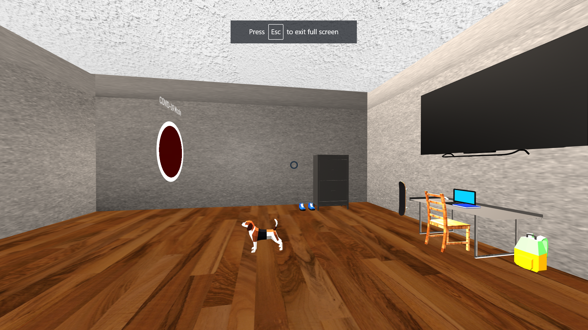

# VRProject1

This is my project for Virtual Reality CS4431. This is a Web-Based VR. I created my room before and after Covid-19 using Three.js and Aframe. Here are some highlights of the project.

# Instructions 

I added a instruction sheet for the user to understand and be confortable in the environment. 

# Dog and Dresser

I added a dog named Ike and a nightstand that is located to the left of my desk.

# Desk

The desk is a big part of my room because I sit in it everyday and do school work. I added my laptop and a notebook. As well as a Rick portal gun and Rick Sanchez uses in the TV show Rick and Morty.

# Bed, Guitar, and Basketball

# Posters

I added 2 posters one of lofi hip hop and one of spiderman. If you click on the lofi hip hop poster lofi hip hop music will play. 

# After Covid19

Since covid19 is a serious virus, I need to make sure my room is clean and Sanitized. 

# Face Mask

There is a face mask that I always put on my dresser to make sure I do not lose it and I keep it next to my keys and wallet so I dont forget.

.png)

# Disinfectant Spray and Paper 

I have bought Disinfectant Spray and Paper Towels and keep them on my desk at all time to clean my desk. 

# Virus 

I made a virus looking object in blender made it red to look like a covid cell. I placed it on common area I am at in my room.

# Conculsion

In conclusion, I think this was a great first project for virtual reality. I felt that I learned the basics of Aframe and I feel confident in my ability to code in AFrame. I would to make a new project in future. 

